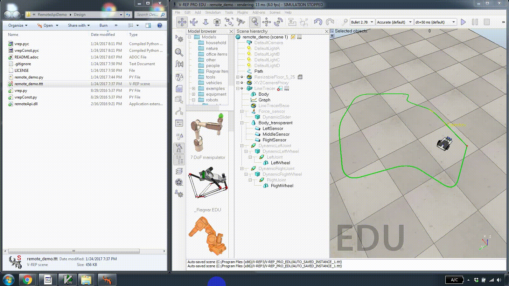

= V-REP Remote API Demo

== Introduction
This is a demo of how to use the http://www.coppeliarobotics.com/[V-REP] remote API to control a robot model during simulation. The robot is a simple line follower and the logic is written in Python.

== Requirements
This demo was creating using the following:

  - V-REP 3.3.2
  - Python 2.7
  - Windows 10

While originally developed on Windows, this demo should work on any OS that supports V-REP by replacing `remoteApi.dll` with the platform-specific remote API library. Refer to the http://www.coppeliarobotics.com/helpFiles/en/remoteApiClientSide.htm[V-REP documentation] for more information.

== Usage
To run this demo:

  . Open `remote_demo.ttt` in V-REP.
  . Once the scene has loaded, run `remote_demo.py`.
  . A simulation should start automatically and the robot will execute the line following logic.
  . The robot logic runs in an infinite loop. Stopping the simulation will cause `remote_demo.py` to exit.

Here's the demo in action:

